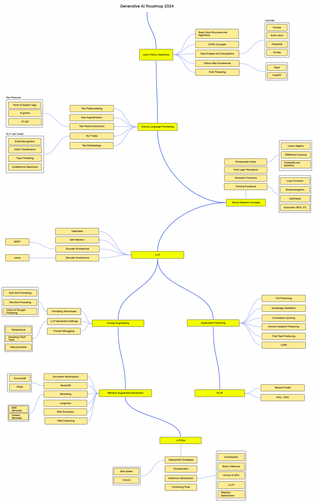

# Generative-AI-Roadmap-2024

This repository contains a visual roadmap to help guide individuals interested in pursuing a career in data science specifically in generative AI. 

The roadmap covers various essential topics, techniques and tools used in the industry today. This is based off my experience working with clients on various products.

This learning path is ideal for people who want to transition to data science from:
- software background
- existing data analytics background
- just started with data science
  
## Roadmap

The updated roadmap is hosted on `roadmap.sh`, which you can access by clicking the link below:

- [Generative AI Roadmap](https://roadmap.sh/r/generative-ai-roadmap-2dmvk)

The roadmap is designed to provide an overview of the different areas and concepts involved in data science, including but not limited to:

- Python for Data Processing
- Natural Language Processing
- Deep Learning
- Large Language Models
- MLOps
- and more

Feel free to use this roadmap as a reference guide to plan your learning journey and track your progress in mastering the necessary skills for a successful career in data science.

You can also reach out to me to any clarifications, corrections or improvements if any.
